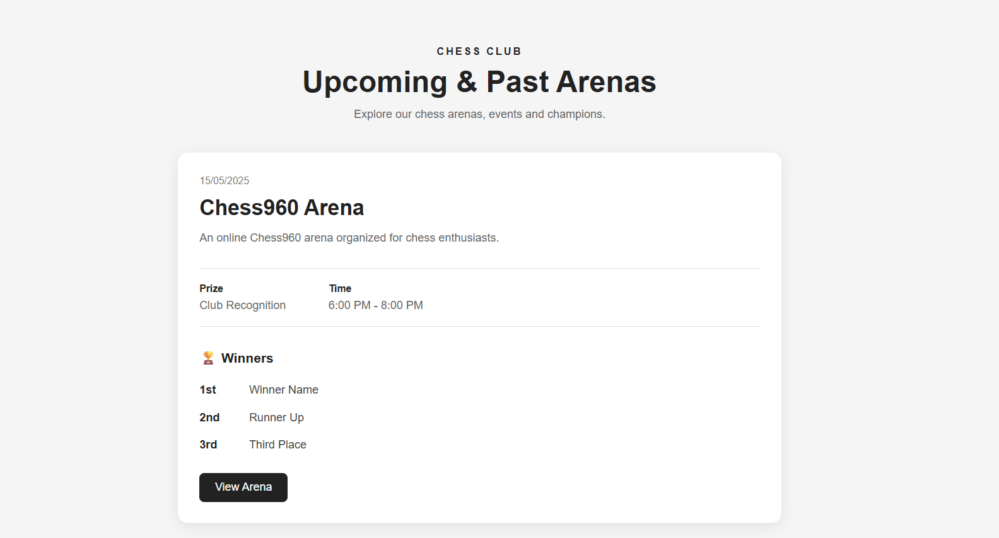
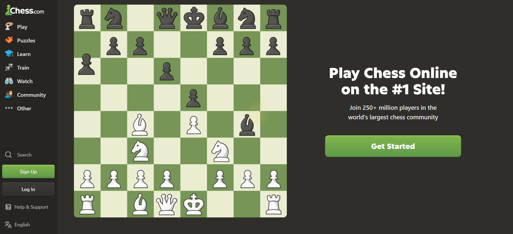
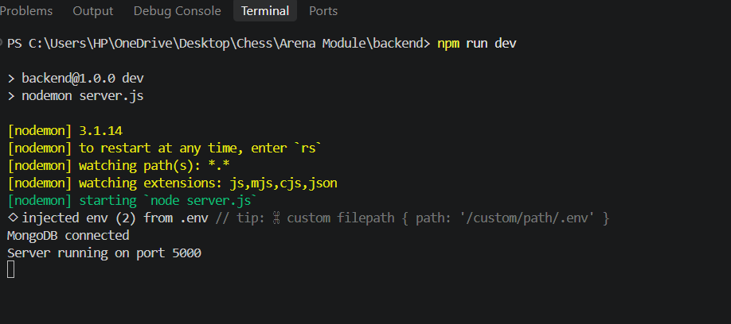
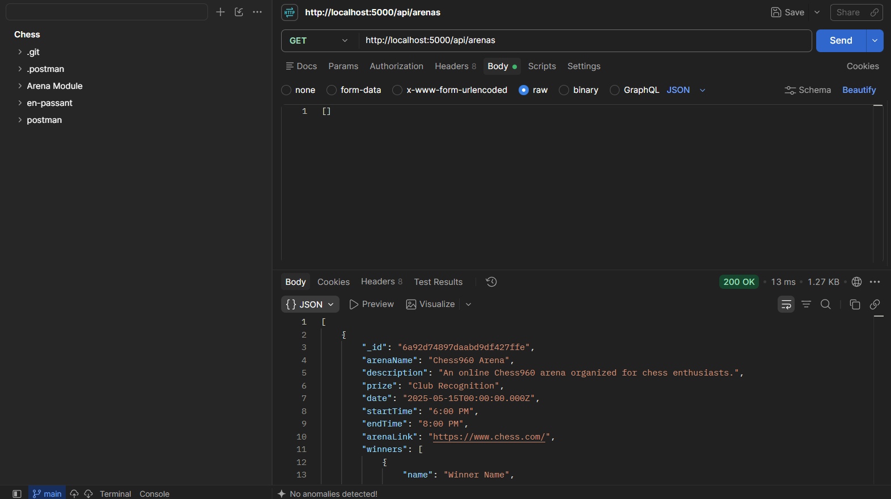
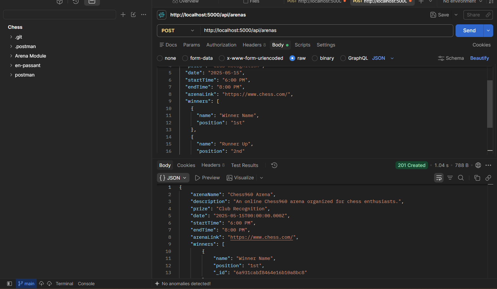

# Chess Club Arena Module

A full-stack Arena Management feature for the Chess Club website.

The module allows chess arenas to be stored in MongoDB and displayed through a React frontend. It also provides APIs for adding and fetching arena information.

## Features

- Add a new chess arena
- Fetch existing arenas
- Display arena details
- Display winners
- Show prize and event timings
- Open the arena link
- Responsive React interface
- MongoDB database integration

## Tech Stack

### Frontend
- React.js
- JavaScript
- HTML5
- CSS3

### Backend
- Node.js
- Express.js

### Database
- MongoDB
- Mongoose

### Tools
- Postman
- Git
- GitHub
- VS Code

## Project Structure

```text
Arena Module/
│
├── arena-frontend/
│   ├── src/
│   │   ├── components/
│   │   │   └── Arenas.jsx
│   │   ├── App.jsx
│   │   ├── App.css
│   │   └── index.css
│   └── package.json
│
├── backend/
│   ├── models/
│   │   └── Arena.js
│   ├── routes/
│   │   └── arenaRoutes.js
│   ├── server.js
│   ├── .env
│   └── package.json
│
└── README.md
```

## Screenshots

### Arena Page



### Add Arena API



### Get Arenas API



### Responsive View



### Project Overview

