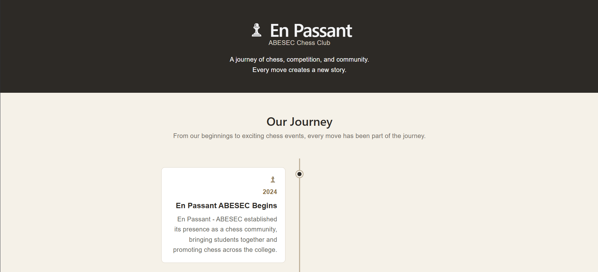
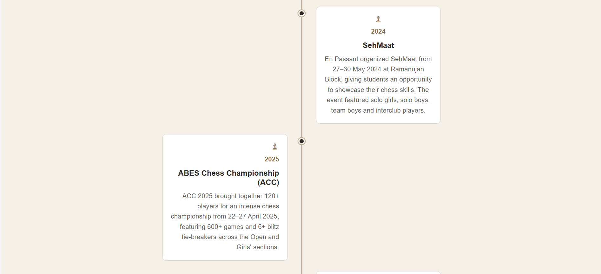
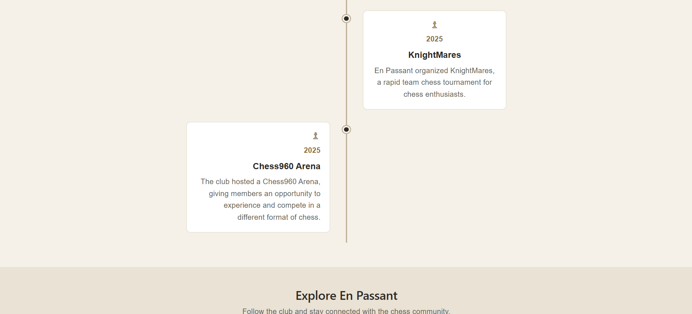
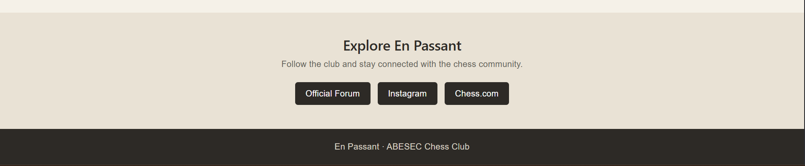

# En Passant ABESEC - Chess Club Timeline

## About

A responsive React timeline showcasing the journey and significant events
of En Passant, the chess club of ABESEC.

## Features

- Responsive design
- Chess club journey timeline
- Club founding/beginning information
- Four significant club events
- Links to official club platforms
- Mobile-friendly layout

## Tech Stack

- React.js
- JavaScript
- HTML/JSX
- CSS
- Vite

## Setup

1. Clone the repository
2. Open the project folder
3. Install dependencies

npm install

4. Start the development server

npm run dev

## Screenshots

## Project Structure

src/
├── components/
│   └── Timeline.jsx
├── App.jsx
├── App.css
└── main.jsx